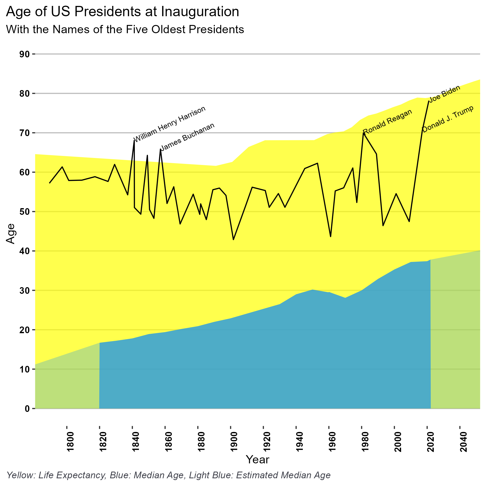
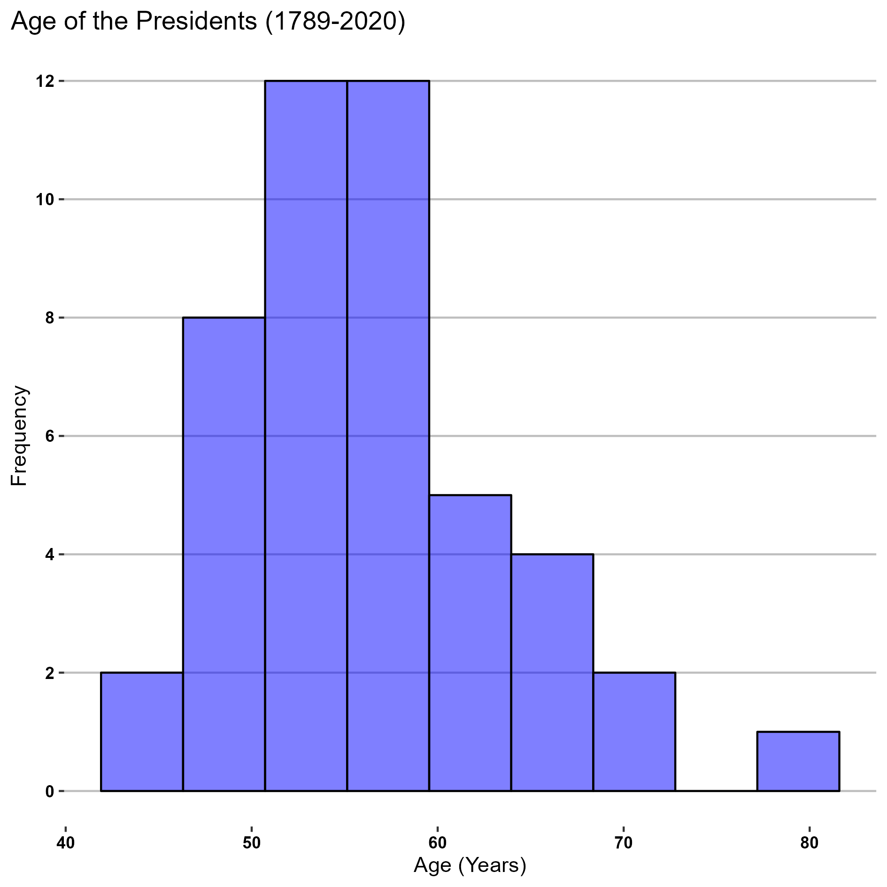
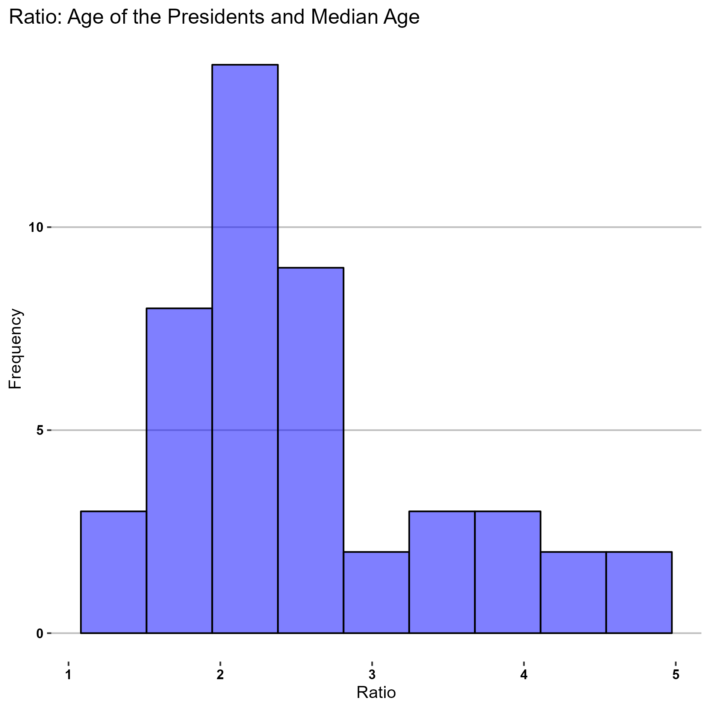
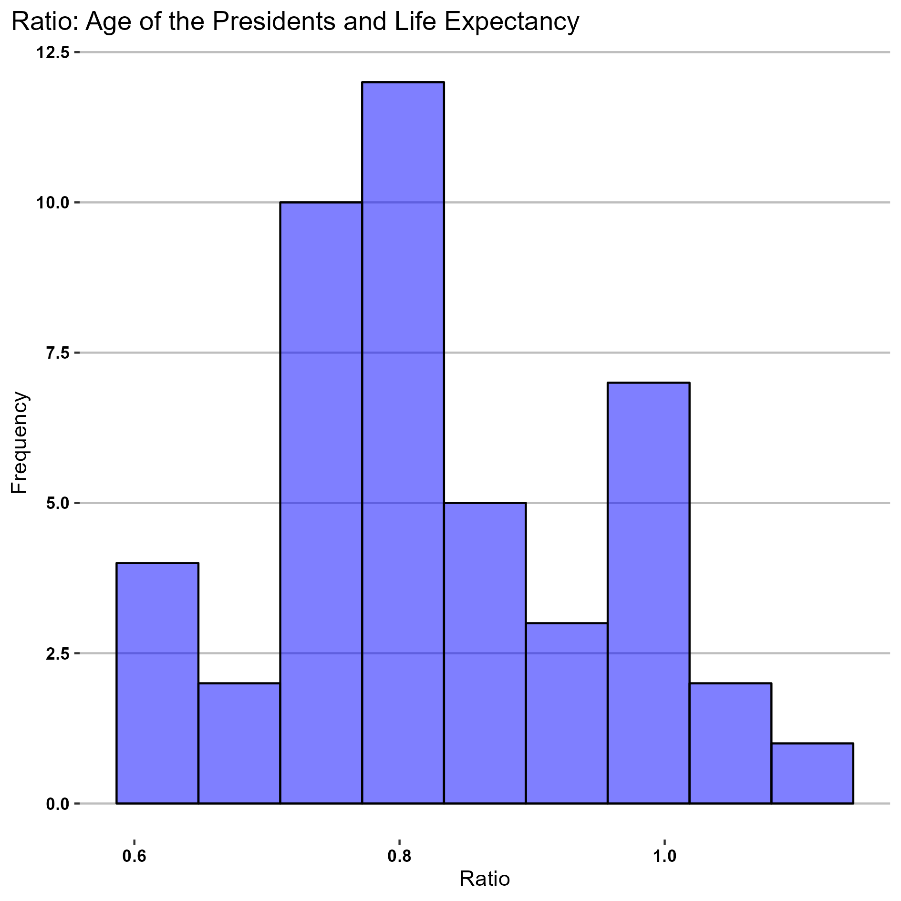

# United States Presidents: Age, Median Age, and Life Expectancy
## Project Goals
### General
Observe if there is *age at time of inauguration* of the United States presidents has a relation with the US *median age* and *life expectancy*.
Historically, United States' population median age and life expectancy have increased but the age of the presidents at time of inauguration does not show a similar trend, with an alternation of young and old presidents. Although is clear that age is not the main cause to select a president, the relation between age of the president and the median age of the population (and, consequently, the electorate) can, in turn, be associated with other events. 
### Specifics
1. Data treatment: Recover data about age of presidents, life expectancy and median age and put these data in data frames.
2. Proportions: determine the relation, in terms of proportion, of the age of the presidents with the median age and life expectancy. 
## Steps and Results
1. Obtain the age of the presidents at time of inauguration. Data frame. 
2. Obtain the life expectancy data. Data Frame.
3. Obtain the median age. Data frame.
4. Determine median age and life expectancy for each inauguration. Columns in the presidents data frame.
5. Determine the proportion of life expectancy and median age for each inauguration.Columns in the presidents data frame.
6. Create a chart with the age of the United States (US) Presidents and compare their age at time of inauguration with the median age and life expectancy.
7. Add, to that chart, the names of the five older US presidents.
8. Descriptive statistics of age of the presidents, age-median age ratio, and age-life expectancy ratio. Histogram and report.
## Chart

## Sources

### Life Expectancy

US from 1950: https://www.macrotrends.net/countries/USA/united-states/life-expectancy

https://www.verywellhealth.com/longevity-throughout-history-2224054

### Inauguration Day 

https://historyinpieces.com/research/presidential-inauguration-dates

### Median Age

US Census: https://www2.census.gov/programs-surveys/decennial/2000/phc/phc-t-09/tab07.pdf

US Census: https://www.census.gov/data/tables/time-series/demo/popest/2020s-national-detail.html

Newsweek: https://edition.cnn.com/2023/05/25/health/us-population-median-age-39/index.html#:~:text=Overall%2C%20the%20new%20data%20reveals%20that%20the%20median,in%202020%2C%20and%20Utah%20had%20the%20youngest%2C%2031.3.

