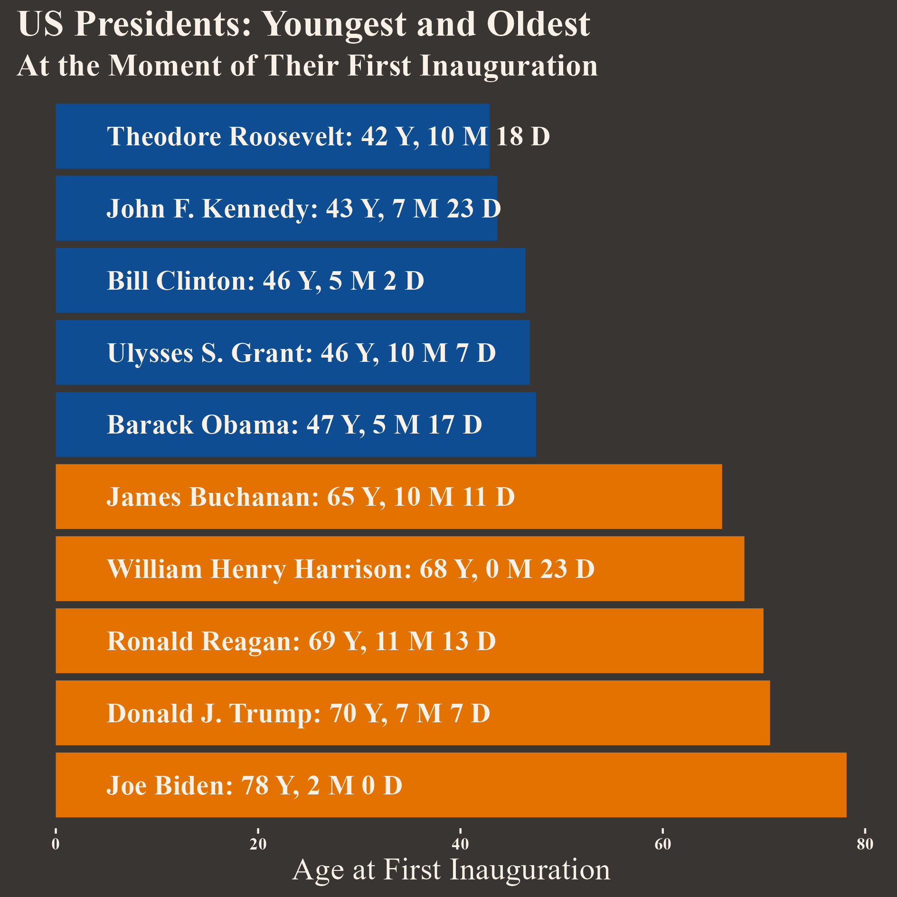

# United States Presidents: Age, Median Age, and Life Expectancy
## Project Goals
### General
Observe if *age at the time of inauguration* of the United States presidents relates to the US *median age* and *life expectancy*.
Historically, the United States population's median age and life expectancy have increased; however, the age of the presidents at the time of inauguration does not show a similar trend, with an alternation of young and old presidents. Although age clearly is not the principal cause of selecting a president, the relation between the president's age and the median age of the population (and, consequently, the electorate) can, in turn, be associated with other events. 
### Specifics
1. Data treatment: Recover data about the age of presidents, life expectancy, and median age and put these data in data frames.
2. Proportions: determine the relation, in terms of proportion, of the age of the presidents with the median age and life expectancy. 
## Steps and Products
1. Obtain the ages of the presidents at the time of inauguration. The product is a data frame. 
2. Obtain the life expectancy data. The product is a data frame. 
3. Obtain the median age. The product is a data frame. 
4. Determine the median age and life expectancy for each inauguration. Columns in the *presidents* data frame.
5. Determine the proportion of life expectancy and median age for each inauguration. The product is a set of columns in the presidents data frame.
6. Create a chart with the age of the United States (US) Presidents and compare their age at the time of inauguration with the median age and life expectancy.
7. To the previous chart, we will add the names of the five older US presidents.
8. Descriptive statistics of the age of the presidents, age-median age ratio, and age-life expectancy ratio. Histogram and report.
## Analysis
1. In the current presidential race, although the oldest candidates offer their projects, the distance with the average age of the US population is not as long as others in US history. William Henry Harrison had the most visible difference with the current US population's average age (50 years, seven months, and seven days). He also exerted the shortest presidency (in office from March 3, 1841 to April 4, 1841). Data shows us that President Adams has the second place in the record of age difference with the population. In this case, however, we have estimated the median age based on a linear regression of the available data. We should read these results with caution. 
2. Interestingly enough, three of the five closest-to-the-median-age presidents took office in the 21st century: Bill Clinton, George W. Bush, and Barack Obama. Clinton and Obama are also among the five youngest presidents. The increase in the median age could partially explain the closer distance between the median age and the age of the presidents. 
3. Are there specific challenges or leadership differences associated with the age of the presidents or their relation with the average age of the population? It does not seem so. Presidents of different ages and relationships with the population have faced different challenges according to their times. A relatively young Franklin D. Roosevelt guided the country through the Great Depression and the Second World War. Being a mature president, Ronald Reagan made decisions that shaped US politics and economics beyond his term. 
## Charts

## Sources

### Life Expectancy

US from 1950: https://www.macrotrends.net/countries/USA/united-states/life-expectancy

https://www.verywellhealth.com/longevity-throughout-history-2224054

### Inauguration Day 

https://historyinpieces.com/research/presidential-inauguration-date s

### Median Age

US Census: https://www2.census.gov/programs-surveys/decennial/2000/phc/phc-t-09/tab07.pdf

US Census: https://www.census.gov/data/tables/time-series/demo/popest/2020s-national-detail.html

Newsweek: https://edition.cnn.com/2023/05/25/health/us-population-median-age-39/index.html#:~:text=Overall%2C%20the%20new%20data%20reveals%20that%20the%20median,in%202020%2C%20and%20Utah%20had%20the%20youngest%2C%2031.3.

# United States Presidents: Age and performance
## Project Goals
### General
Observe if *age at the time of inauguration* of the United States presidents relates to *performance*, measured by the Siena College Research Institute's (SCRI) Survey of U.S. Presidents.
Although, in general, our mental abilities decline as we age, some peak at one moment of our lives, while others can reach their full potential at a different age. Based on this idea, we will put together age and performance. The final assessment of a presidency (seen through the eyes of historians), when related to age, could reveal some patterns for future explorations. In this sense, we have no specific hypotheses, our aim being more exploratory than explanatory. 
### Specifics
1. Data treatment: Recover data about the U.S. presidents' performance as measured by the SCRI.
2. Visualization: Create a plot with age on the x-axis and performance on the y-axis. Separate four regions based on the median values of age and performance: old and good performance, old and poor performance, young and good performance, and young and poor performance. 
## Steps and Products
1. Recover data about the U.S. presidents' performance as measured by the SCRI. The product is a data frame. 
2. Join the data frame of the previous step with the data frame *presidents* created in the section "United States Presidents: Age, Median Age, and Life Expectancy." The product is a new column in the data frame *presidents*. 
3. Create a new column with the reversed values of performance. The goal is to match the highest ranks with the highest values. 
4. Using *ggplot2*, visualize our data following these steps: Scatter plot of age (x-axis) vs performance (reverse scale in the y-axis) with a regression line. Draw two lines: one vertical based on the median age and another horizontal based on the median performance. The product is the *performance_age* graph.
5. Following the median based lines in the *performance_age* graph, create four different zones. The product is a new set of layers in the graph.
6. Brief report with our findings. The product is the subsection "Analysis." 
## Sources

### Presidents' Performance

Siena College Research Institute: https://scri.siena.edu/2022/06/22/american-presidents-greatest-and-worst/

